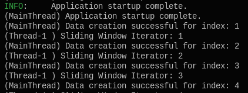
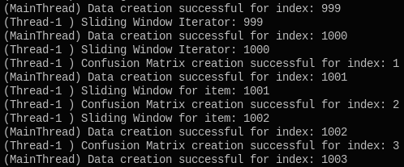
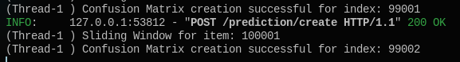

# Tazı Project

Objective is to simulate 2 concurrent tasks:

+ Continuosly Growing Datasource, simulating a client's input to our database
+ Confusion Matrix calculations based on sliding window over 1000 predictions from 3 different models

## Backend

Both tasks run on different threads.

Note that Confusion Matrix calculations starts immediately as datastorege gets populated

Confusion Matrix calculation are done whenever it is possible

Also there is an API support both for new inputs and User Interface. Docs are located at `localhost:8000/docs`

As you can see, our calculation thread waits for new inputs on Database even after the fixed input (CSV data) has finished 

## UI

On `localhost:8501` there is a bar plot for given matrix id, and showing on next matrix which predictions are going to be discarded and included.

