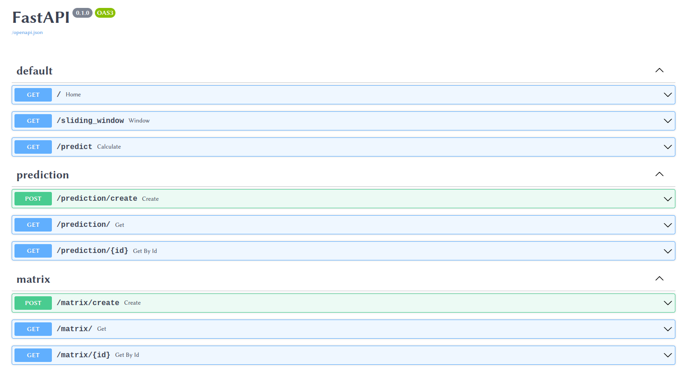
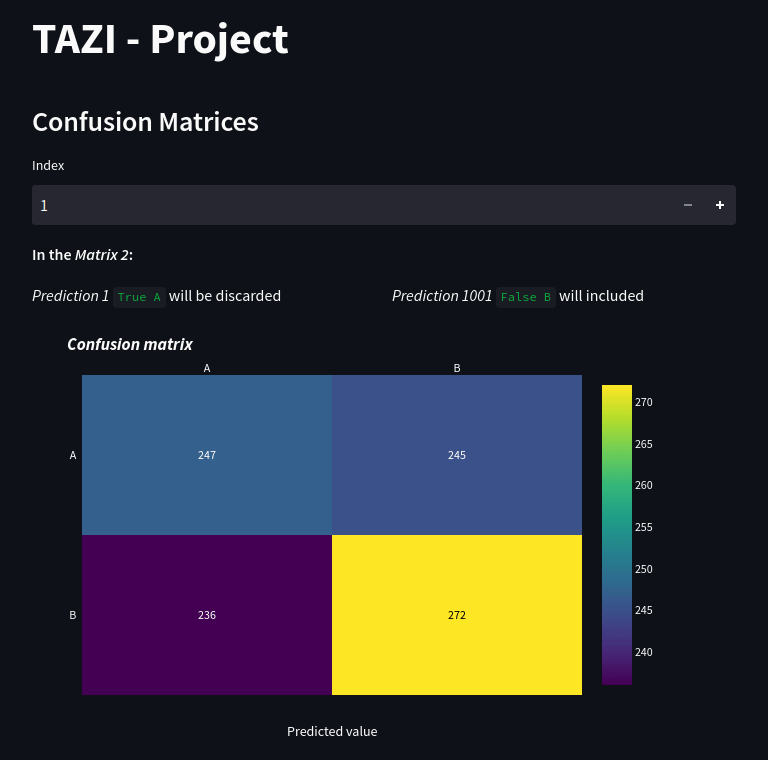

# Tazı Project

Objective is to simulate 2 concurrent tasks:

+ Continuosly Growing Datasource, simulating a client's input to our database
+ Confusion Matrix calculations based on sliding window over 1000 predictions from 3 different models

## Backend

Both tasks run on different threads.

```console
INFO:     Application startup complete.
(MainThread) Application startup complete.
(MainThread) Data creation successful for index: 1
(Thread-1 ) Sliding Window Iterator: 1
(MainThread) Data creation successful for index: 2
(Thread-1 ) Sliding Window Iterator: 2
(MainThread) Data creation successful for index: 3
(Thread-1 ) Sliding Window Iterator: 3
```

Note that Confusion Matrix calculations starts immediately as datastorege gets populated

```console
(Thread-1 ) Sliding Window Iterator: 1000
(MainThread) Data creation successful for index: 1001
(Thread-1 ) Confusion Matrix creation successful for index: 1
(Thread-1 ) Sliding Window for item: 1001
(Thread-1 ) Confusion Matrix creation successful for index: 2
(MainThread) Data creation successful for index: 1002
(Thread-1 ) Sliding Window for item: 1002
```

Confusion Matrix calculation are done whenever it is possible



Also there is an API support both for new inputs and User Interface. Docs are located at `localhost:8000/docs`

```console
(Thread-1 ) Confusion Matrix creation successful for index: 99001
INFO:     127.0.0.1:53812 - "POST /prediction/create HTTP/1.1" 200 OK
(Thread-1 ) Sliding Window for item: 100001
(Thread-1 ) Confusion Matrix creation successful for index: 99002
```

As you can see, our calculation thread waits for new inputs on Database even after the fixed input (CSV data) has finished 

## UI

On `localhost:8501` there is a bar plot for given matrix id, and showing on next matrix which predictions are going to be discarded and included.


